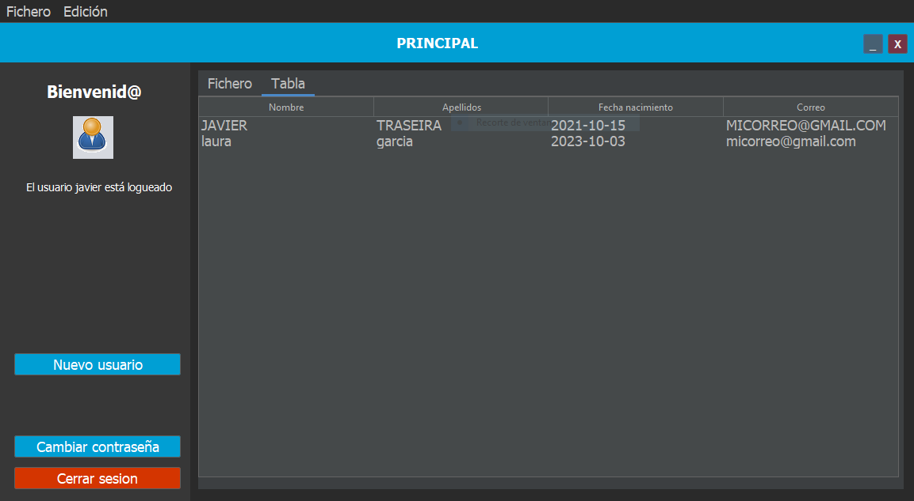
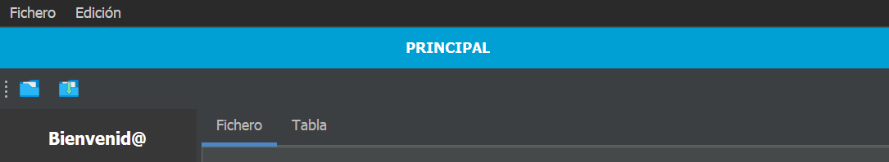

# Proyecto Trimestral de Desarrollo de Interfaces (DI) 24/25

Partiendo del modelo y del código de la aplicación práctica creada en Java Swing en la práctica 3.1, mejorarla para agregarle nuevas funcionalidades, uso de librerías, mejora de la usabilidad,  mejora del MVC utilizado y de un instalador y ejecutables adjuntos.

## Posibles mejoras propuestas

### Conversión del proyecto a Maven

Crea un nuevo proyecto utilizando **Maven** y copia las clases y paquetes del antiguo proyecto en el nuevo:
- Busca y resuelve las **dependencias** usadas por Maven para lograr hacerlo funcionar. Para ello deberás modificar el fichero `pom.xml`
- Empaqueta nuevamente el proyecto en formato *jar* y genera el ejecutable.

### Agregar JTabbedPane y un JTable

Agrega un *JTabbedPane* con al menos dos pestañas en el panel principal:

- Una pestaña para mostrar el campo de contenido del fichero de texto. Agrega la opción para poder editar su contenido y también poder guardar los cambios desde el menú archivo.
- Añade otra pestaña que muestre un *JTable* que sea el resultado de consultar el contenido de los usuarios dados de alta actualmente en el sistema, mostrando todos sus campos en diferentes columnas.

Mejora la ventana creando una *JToolbar* superior con los botones de acción rápida más utilizados (abrir, guardar) con sus respectivos iconos.

## Valoración de apartados del proyecto

- Criterios y requerimientos básicos del proyecto (**35%**)
   	- Cumple con todos los requerimientos pedidos hasta la *práctica 3.1* haciendo un uso adecuado del **MVC** y del traspaso de datos.
	- Hace una mejora básica de usabilidad y del diseño.
	- Genera un fichero `jar` y un `ejecutable` funcional del proyecto.
- Otros criterios (**65%**)
	- Mejora de la **usabilidad**:
		- Guía de estilo completa adjunta [guía de estilo](Plantilla_guia_de_estilo.md)
		- Diseño de la interfaz usable con criterios de usabilidad claros.
		- Uso de validaciones y mensajes de error comprensibles.
	- Mejora de las **funcionalidades**:
		- Utilidad y mejora de las funcionalidades.
		- Utilización de los elementos propuestos en posibles mejoras: JTabbedPane, JTable y otras
	- Mejora del **proyecto**:
		- Conversión del proyecto a *Maven* y resolución de dependencias.
		- Documentación mínima del código y funciones.
	- Creación del **ejecutable y del instalador**:
		- Creación de un asistente de instalación.
		- Resolución de las librerías y del funcionamiento de la BD.
		- Existencia de documentación en un fichero README.
	- Se adjunta la tabla de casos de prueba
		- Inclusión de nuevos elementos de prueba.
		- Validación de los casos de prueba.

## Modelo de rúbrica de evaluación

|                  | **Max** | **Pts** |
|------------------|---------|---------|
| **General (35%)** |         |         |
| a) **Requerimientos básicos del proyecto (*práctica 3.1*)** | **3,5** |         |
| Uso adecuado del MVC y traspaso de datos entre clases |         |         |
| Creación del fichero jar y del ejecutable |         |         |
| **Proyecto (65%)** |         |         |
| b) **Mejora de la usabilidad (*práctica 3.1*)** | **1,5** |         |
| Se adjunta una guía de estilo completa |         |         |
| Diseño de interfaz usable |         |         |
| Uso de mensajes de error y/o validación adecuados |         |         |
| c) **Mejora y nuevas funcionalidades** | **3** |         |
| Utilización de otros elementos (JTable, iconos...) |         |         |
| Lectura fichero de configuración de la BD |         |         |
| d) **Mejora del proyecto Netbeans** | **1,5** |         |
| Conversión a Maven y resolución de dependencias |         |         |
| Documentación mínima del código y funciones |         |         |
| e) **Creación de un instalador y tabla casos de prueba** | **0,5** |         |
| Creación de un instalador y una tabla de pruebas ampliada |         |         |

